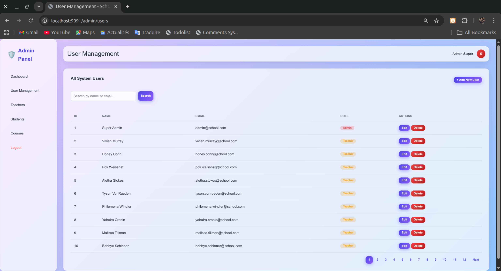
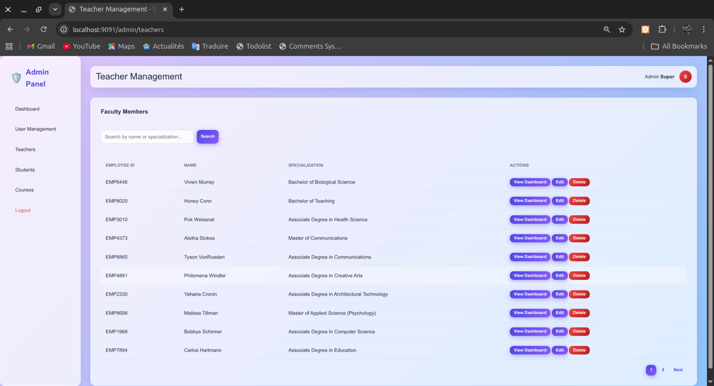
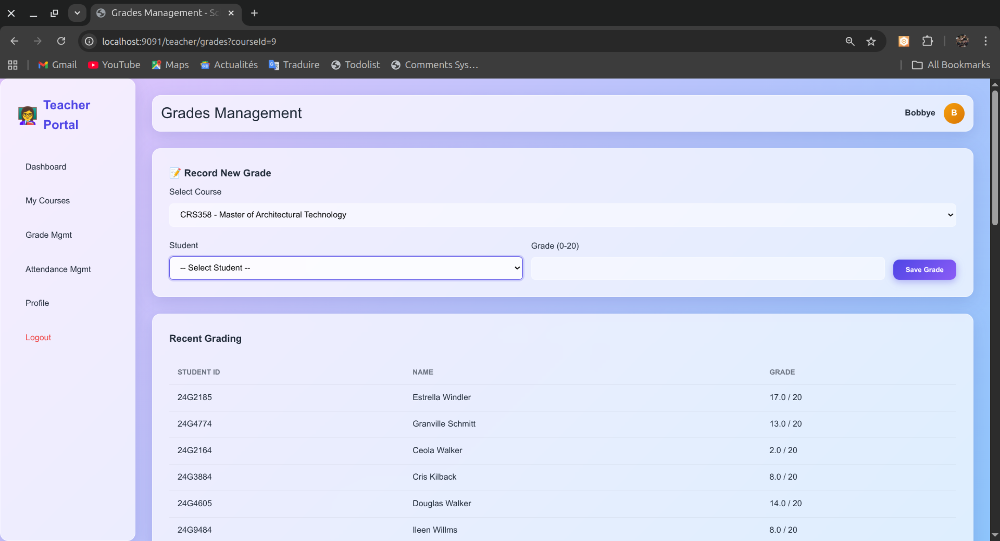
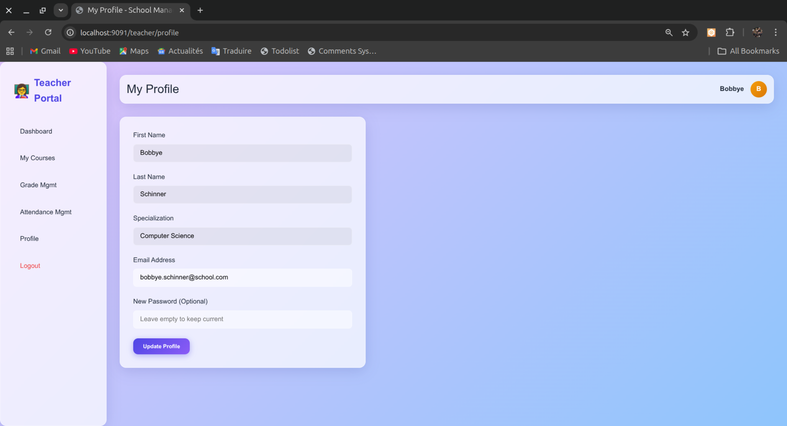
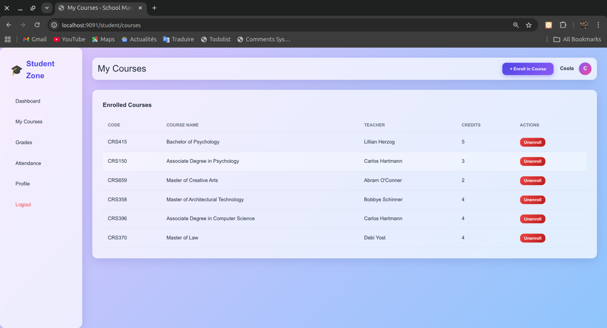
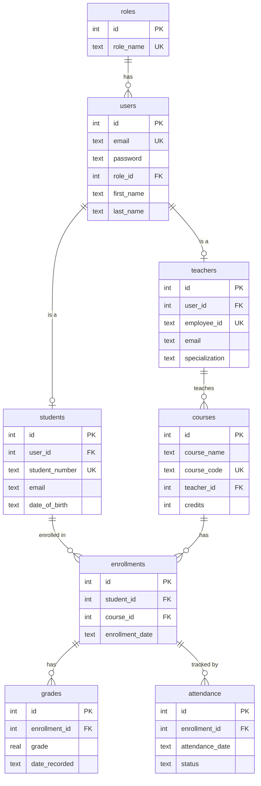

<p align="center">
  <h1 align="center">🎓 School Management System</h1>
  <p align="center">
    A comprehensive, layered Java Web Application for managing school operations.
    <br />
    Built with Jakarta EE 10, following a clean Controller → Service → DAO architecture.
  </p>
</p>

<p align="center">
  
  
  
  
  
  
</p>

---

## 📖 Table of Contents

- [Overview](#-overview)
- [Screenshots](#-screenshots)
- [Architecture](#-architecture)
- [Tech Stack](#-tech-stack)
- [Project Structure](#-project-structure)
- [Database Schema](#-database-schema)
- [Getting Started](#-getting-started)
- [Running Tests](#-running-tests)
- [Default Credentials](#-default-credentials)
- [License](#-license)

---

## 🔍 Overview

The School Management System streamlines administrative tasks for educational institutions. It provides three distinct role-based portals, each tailored to the specific needs of its users:

| Portal | Description |
| :--- | :--- |
| **🛡️ Admin Panel** | Full CRUD for Users, Students, Teachers, and Courses. Dashboard with system-wide statistics. User impersonation for support and debugging. |
| **📚 Teacher Portal** | Manage assigned courses. Enter/update student grades (0-20 scale). Record and track daily attendance (Present, Absent, Late). |
| **🎒 Student Zone** | View personal dashboard (GPA, Attendance Rate). Self-enroll/unenroll from courses. View grade and attendance history. |

---

## 📸 Screenshots

<details>
<summary><b>🛡️ Admin Panel</b> (click to expand)</summary>
<br/>

**User Management** — Full CRUD, search, and pagination for all system users.


<br/>

**Teacher Management** — View and manage faculty members with impersonation support.


</details>

<details>
<summary><b>📚 Teacher Portal</b> (click to expand)</summary>
<br/>

**Grades Management** — Select a course and enter grades for enrolled students.


<br/>

**Profile** — Update personal information and credentials.


</details>

<details>
<summary><b>🎒 Student Zone</b> (click to expand)</summary>
<br/>

**My Courses** — View enrolled courses and unenroll, or discover new courses to enroll in.


</details>

---

## 🏗 Architecture

The application follows a **layered MVC architecture** with clear separation of concerns:

```
┌─────────────────────────────────────────────┐
│                 JSP Views                   │  ← Presentation Layer
│     (admin/ | teacher/ | student/)          │
├─────────────────────────────────────────────┤
│              Servlets (Controllers)         │  ← Web Layer
│  AdminServlet | TeacherServlet | Student…   │
├─────────────────────────────────────────────┤
│          Service Layer (Business Logic)     │  ← Business Layer
│  AdminService | TeacherService | Student…   │
│             ServiceFactory                  │
├─────────────────────────────────────────────┤
│             DAO Layer (Data Access)         │  ← Persistence Layer
│    Interfaces  →  SQLite Implementations    │
├─────────────────────────────────────────────┤
│              SQLite Database                │  ← Data Store
│               (school.db)                   │
└─────────────────────────────────────────────┘
```

**Key Design Decisions:**
- **Service Layer**: All business logic (GPA calculation, attendance tracking, grade management, user creation with role cascading) is encapsulated in dedicated service classes, keeping controllers thin.
- **ServiceFactory**: A centralized factory providing singleton instances of each service, pre-wired with their DAO dependencies.
- **DAO Pattern**: Clean interfaces (`UserDao`, `StudentDao`, etc.) with SQLite-specific implementations, making the persistence layer swappable.
- **Connection Pooling**: HikariCP for efficient database connection management.

---

## 🛠 Tech Stack

| Layer | Technology | Version | Purpose |
| :--- | :--- | :---: | :--- |
| **Language** | Java | 17 | Core language |
| **Web Framework** | Jakarta Servlet | 6.0 | HTTP request handling |
| **View Engine** | Jakarta JSP + JSTL | 3.1 / 3.0 | Server-side rendering |
| **Database** | SQLite | 3.45 | Lightweight relational DB |
| **Connection Pool** | HikariCP | 5.1 | High-performance pooling |
| **Server** | Jetty (EE10) | 12.0.5 | Embedded dev server |
| **Security** | jBCrypt | 0.4 | Password hashing |
| **Data Seeding** | Datafaker | 2.1 | Realistic test data |
| **Logging** | SLF4J | 2.0.12 | Logging facade |
| **Testing** | JUnit 5 + Mockito | 5.10 / 5.10 | Unit testing |
| **Build** | Maven | 3.6+ | Build & dependency mgmt |

---

## 📂 Project Structure

```
src/
├── main/
│   ├── java/com/example/school/
│   │   ├── dao/                    # Data Access Objects
│   │   │   ├── UserDao.java        #   Interfaces
│   │   │   ├── StudentDao.java
│   │   │   ├── TeacherDao.java
│   │   │   ├── CourseDao.java
│   │   │   ├── EnrollmentDao.java
│   │   │   ├── GradeDao.java
│   │   │   ├── AttendanceDao.java
│   │   │   ├── RoleDao.java
│   │   │   ├── db/                 #   Database Manager
│   │   │   └── impl/              #   SQLite Implementations
│   │   │
│   │   ├── model/                  # Entity Classes
│   │   │   ├── User.java
│   │   │   ├── Student.java
│   │   │   ├── Teacher.java
│   │   │   ├── Course.java
│   │   │   ├── Enrollment.java
│   │   │   ├── Grade.java
│   │   │   ├── Attendance.java
│   │   │   └── Role.java
│   │   │
│   │   ├── service/                # Business Logic Layer
│   │   │   ├── ServiceFactory.java #   Centralized DI
│   │   │   ├── UserService.java    #   Authentication
│   │   │   ├── AdminService.java   #   Admin operations
│   │   │   ├── StudentService.java #   Student operations
│   │   │   └── TeacherService.java #   Teacher operations
│   │   │
│   │   ├── util/                   # Utilities
│   │   │   ├── DataSeeder.java     #   Database seeding
│   │   │   └── PasswordUtil.java   #   BCrypt hashing
│   │   │
│   │   └── web/controller/         # Servlet Controllers
│   │       ├── AdminServlet.java
│   │       ├── StudentServlet.java
│   │       ├── TeacherServlet.java
│   │       ├── LoginServlet.java
│   │       └── LogoutServlet.java
│   │
│   └── webapp/
│       └── WEB-INF/views/          # JSP Views
│           ├── admin/              #   Admin panel views
│           ├── teacher/            #   Teacher portal views
│           ├── student/            #   Student zone views
│           ├── layout/             #   Shared layout components
│           └── login.jsp
│
└── test/java/com/example/school/
    └── service/                    # Unit Tests (JUnit 5 + Mockito)
        ├── UserServiceTest.java
        ├── AdminServiceTest.java
        ├── StudentServiceTest.java
        └── TeacherServiceTest.java
```

---

## 💾 Database Schema

The application uses a relational SQLite database (`school.db`) with 8 tables and foreign key constraints enabled:



> **Note**: Grades use a 0-20 scale with a `CHECK` constraint. Attendance statuses are: `PRESENT`, `ABSENT`, `LATE`.

---

## ⚡ Getting Started

### Prerequisites
*   **JDK 17** or higher
*   **Maven 3.6+**

### Installation

1.  **Clone the repository**
    ```bash
    git clone <repository-url>
    cd SN_JEE
    ```

2.  **Build the project**
    ```bash
    mvn clean install
    ```

3.  **Run the application**
    ```bash
    mvn jetty:run
    ```

4.  **Open in browser**
    Navigate to → [http://localhost:9091](http://localhost:9091)

> The database is automatically created and seeded on first run if `school.db` does not exist.

---

## 🧪 Running Tests

The project includes unit tests for the service layer using **JUnit 5** and **Mockito**:

```bash
mvn test
```

Tests cover:
*   `UserServiceTest` — Authentication logic and profile updates
*   `AdminServiceTest` — Dashboard stats, user CRUD, cascading deletes
*   `StudentServiceTest` — GPA calculation, enrollment/unenrollment, course filtering
*   `TeacherServiceTest` — Grade management, attendance tracking, student data queries

---

## 🔐 Default Credentials

On first launch, the database is seeded with realistic data via `DataSeeder` + `Datafaker`.

| Role | Email | Password | Count |
| :--- | :--- | :--- | :---: |
| **Admin** | `admin@school.com` | `admin123` | 1 |
| **Teacher** | `firstname.lastname@school.com` | `password123` | 15 |
| **Student** | `firstname.lastname@student.school.com` | `password123` | 100 |

Additional seeded data:
*   **12 Courses** assigned to random teachers
*   **3-6 Enrollments** per student in random courses
*   **Grades** (0-20) for each enrollment
*   **5 Attendance records** per enrollment (~80% Present, ~20% Absent/Late)

> 💡 **To reset the database**: delete `school.db` from the project root and restart the application.

---

## 📜 License

This project is licensed under the [MIT License](LICENSE).
